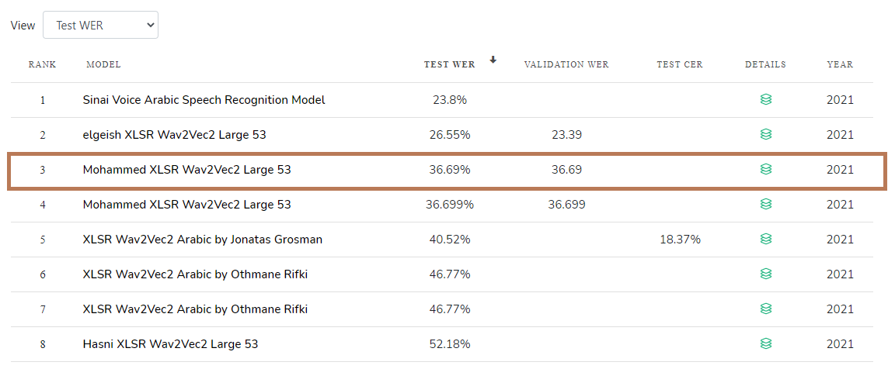

\pagenumbering{roman}
\bigskip

\noindent
__Supervisor:__ Filip Ekström  
__Examiner:__ Jose M. Peña\   
__External Supervisor:__ Juan Verhook\  


\hfill\break
\hfill\break
\hfill\break
\hfill\break
\hfill\break
\hfill\break
\hfill\break
\hfill\break


\begin{figure}[h]
  \includegraphics{liu.png}
\end{figure}

\begin{center}
\LARGE Division of Statistics and Machine Learning  

\LARGE Department of Computer and Information Science  

\LARGE Linköping University   

\LARGE 2021

\end{center}


```{r setup, include=FALSE}
knitr::opts_chunk$set(echo = TRUE)
```
```{r, include=FALSE}
options(tinytex.verbose = TRUE)
```

\newpage  

\begin{center}
\addcontentsline{toc}{section}{Copyright}

\large{Upphovsrätt}

\end{center}

 

Detta dokument hålls tillgängligt på Internet – eller dess framtida ersättare – under 25 år från publiceringsdatum under förutsättning att inga extraordinära omständigheter uppstår.
Tillgång till dokumentet innebär tillstånd för var och en att läsa, ladda ner, skriva ut enstaka kopior för enskilt bruk och att använda det oförändrat för ickekommersiell forskning och för undervisning. Överföring av upphovsrätten vid en senare tidpunkt kan inte upphäva detta tillstånd. All annan användning av dokumentet kräver upphovsmannens medgivande. För att garantera äktheten, säkerheten och tillgängligheten finns lösningar av teknisk och administrativ art.
Upphovsmannens ideella rätt innefattar rätt att bli nämnd som upphovsman i den omfattning som god sed kräver vid användning av dokumentet på ovan beskrivna sätt samt skydd mot att dokumentet ändras eller presenteras i sådan form eller i sådant sammanhang som är kränkande för upphovsmannens litterära eller konstnärliga anseende eller egenart.
För ytterligare information om Linköping University Electronic Press se förlagets hemsida https://ep.liu.se/ .
 


\bigskip

\begin{center}

\large{Copyright}

\end{center}
\bigskip

The publishers will keep this document online on the Internet - or its possible replacement - for a period of 25 years starting from the date of publication barring exceptional circumstances.  
The online availability of the document implies permanent permission for anyone to read, to download, or to print out single copies for his/hers own use and to use it unchanged for non-commercial research and educational purpose. Subsequent transfers of copyright cannot revoke this permission. All other uses of the document are conditional upon the consent of the copyright owner. The publisher
has taken technical and administrative measures to assure authenticity, security and accessibility.  
According to intellectual property law the author has the right to be mentioned when his/her work is accessed as described above and to be protected against infringement.  
For additional information about the Linköping University Electronic Press and its procedures for publication and for assurance of document integrity, please refer to its www home page: http://www.ep.liu.se/.


\newpage 

\begin{center}

\large{Abstract}

\end{center}

\bigskip
 
\addcontentsline{toc}{section}{Abstract}
 
The importance of Automatic Speech Recognition (ASR) Systems, whose job is to generate text from audio, is increasing as the number of applications of these systems is rapidly going up. However, when it comes to training ASR systems, the process is difficult and rather tedious, and that could be attributed to the lack of training data. ASRs require huge amount of annotated training data containing the audio files and the corresponding accurately written transcript files. This annotated (labeled) training data is very difficult to find for most of the languages, it usually requires people to perform the annotation manually which, apart from the monetary price it costs, is error-prone. A supervised training task is impractical for this scenario. 

Arabic language is one of the languages that do not have an abundance of labeled data, which makes its ASR system's accuracy very low compared to other resource-rich languages such as English, French, or Spanish. In this research, we take advantage of unlabeled voice data by learning general data representations from unlabeled training data (only audio files) in a self-supervised task or pre-training phase. This phase is done by using wav2vec 2.0 framework which masks out input in the latent space and solves a contrastive task. The model is then fine-tuned on a few amounts of labeled data. We also exploit models that have been pre-trained on different languages, by using wav2vec 2.0, for the purpose of fine-tuning them on Arabic language by using annotated Arabic data.  

We show that using wav2vec 2.0 framework for pre-training on Arabic is considerably time and resource-consuming. It took the model 21.5 days 21.5 days (about 3 weeks) to complete 662 epochs and get a validation accuracy of 58%.  Arabic is a right-to-left (rtl) language with many diacritics that indicate how letters should be pronounced, these two features make it difficult for Arabic to fit into these models, as it requires heavy pre-processing for the transcript files. We demonstrate that, we can fine-tune a cross-lingual model, that is trained on raw waveform of speech in multiple languages, on Arabic data and get low word error rate 36.53%. We also prove that by fine-tuning the model parameters we can increase the accuracy, thus, decrease the word error rate from 54.00% to 36.69%.   


\newpage 

\begin{center}

\large{Acknowledgements}

\end{center}

\bigskip
\addcontentsline{toc}{section}{Acknowledgements} 

All praise and thanks due to Allah who blessed me with courage, strength, patience, and health, and who let me live to see this thesis through. This publication is part of my research work at Linköping University, funded by a Swedish Institute scholarship.  

I would like to express my special appreciation and thanks to my supervisor Filip Ekström, you have been a tremendous mentor for me. I also want to thank my examiner Jose M. Pena for his critical feedback and orientation, and our program director Oleg Sysoev for his constant support. My thank also goes to Agustín Valencia for his constructive feedback.     

My sincere thanks go to Digitaltolk company for allowing me to conduct this thesis, especially my company supervisor Juan who was a great support during this journey.  

Words cannot express how grateful I am to my father for all the sacrifices that he has made on my behalf.  
Thank you Father.  

Thank you, my fellow, had it not been for all your prayers and benedictions were it not for your sincere love and help, I would never have completed this thesis. I do thank you all.  

\newpage  

\pagenumbering{arabic}


# Introduction  

\noindent

Acoustic Speech Recognition (ASR) systems enable machines to recognize human speech and transcribe it into text. There are currently many problems facing ASR Systems, to mention a few: the first one is the speaker problem, and this could be the speaker emotions, gender variation, or age variation. Secondly, the vocal track length could also affect the way people pronounce words. Thirdly, the background and channel noise, this could appear as children noise in a car or in a metro station, or channel noise when speaking over a phone or wireless devices in general. One of the challenging problems is the different accents within the same language (Arabic in this context) could vary depending on the speaker’s country of origin [@shrawankar2013adverse].  

In the last years Automatic Speech Recognition systems have improved the state of the art significantly. Open-source collaborations such as Wav2Vec 2.0 [@2020arXiv200611477B] and Mozilla DeepSpeech [@hannun2014deep] have brought the speech to text community together to allow anyone to train their own models with a comparable performance of the best models 2 years ago with 100 times less data [@Mozilla]. The problem of data collection is still significant and finding new ways of addressing these issues is critical for the speech to text models of the future.  

In the initial stages, Hidden Markov Models (HMM) were used as a stochastic approach to solve the problem of speech recognition. HMM achieved good results, but it also had many limitations [@hmm]. A few of these limitations were solved by HMM/Gaussian mixture models (HMM/GMM), in any case, numerous remained unsolved [@1369308]. After that, a hybrid of deep neural networks (DNN) and HMM was shown to significantly improve ASR performance over the mixture of Gaussian mixture model and Hidden Markov Models (GMM-HMM) [@6681449][@6854824].  

A problem that appears when using DNN in speech recognition is the enormous quantities of labeled data that is essential for training neural networks which, in many fields, is more difficult to find than unlabeled data. Thousands of hours of transcribed speech are required to achieve high model accuracy, this large number of hours is unavailable for most of the more than 7000 spoken languages [@Ethnologue]. Learning purely from labeled examples does not resemble language acquisition in humans: infants learn language by listening to adults around them - a process that requires learning good representations of speech [@2020arXiv200611477B].  

People usually do not transcribe what they say, one must label many hours by themselves or hire someone to do this rather tedious job for them. Even though, this could work in many cases, we still have the hurdle of spoken vs written languages as the same written word could have different pronunciations depending on different speakers. ASR systems have long been relying on labeled data for better performance, so, the more transcribed training data we get the higher the performance. This could mean, for languages with different accents, one must have hours of labeled training data for each accent to acquire high performance in that specific accent. A solution for this problem of labeled data scarcity is to have an unsupervised task where the model is pre-trained on huge amount of unlabeled data (which is easier to find), and then finetune the pre-trained model on a few hours of labeled data in a supervised task, this solution is referred to as Self-supervised Learning (SSL) [@baevski2020vqwav2vec].   


\newpage  

## Background   

Per capita, Sweden received the most asylum seekers globally in 2015. Beyond accepting refugees via its longstanding resettlement program, Sweden has taken in rising numbers of asylum seekers since 2012, exceeding 40,000 per year. Most of these recent arrivals have been Syrians, Afghans, and Iraqis [@migrationpolicy]. The language barrier has been a big issue for those immigrants when they see a doctor or have a job interview. DigitalTolk is a company that provides interpretation and translation services to public and private sector in Sweden. Patients in emergency rooms, migrants in trauma units, or a job seeker who can not speak Swedish are ought to get the support they need for a better life.  

DigitalTolk provides more than 200 languages and dialects support, it has translators and interpreters who speak all those languages. One has to book an interpreter, a person in the current setup, through DigitalTolk's booking system, then the interpreter will be assigned to the client based on an importance score. The current booking system is built on the basis of several importance algorithms, such as the interpreter's interests, experience, competence, or previous feedback from clients.  

Even though, the current solution might be efficient for many scenarios, a faster and more efficient and effective way would be to build an Automatic Speech Recognition (ASR) systems by using the state-of-the-art speech recognition technologies. This new ASR system interprets from Swedish to Arabic and from Arabic to Swedish in real time, it allows non-Arabic-speaking healthcare workers to communicate with patients who are unable to speak Swedish. The ASR does the interpretation through a device that listens to a sentence in a language and then speaks that sentence in another language.  

To build an ASR system, a huge amount of training and validation data is needed for the model to achieve high accuracy, and this poses a challenge for building this system as the problem of data annotation (labeled datasets) has been a major issue for ASR systems, and that could be attributed to the fact that individuals generally do not write as much as they speak, and the spoken language tends to be different than the written form of that language (different dialects). Because of this, a model that utilizes a few amounts of labeled (annotated) data, yet achieves high prediction accuracy is needed. Building an ASR with low amounts of annotated Arabic training data will subsequently lay the foundation for building other ASRs for different Arabic dialects or even other languages.   

## Research Questions:   

This research answers the following questions:   

* The problem of data collection is still significant and finding new ways of addressing these issues is critical for the speech to text models of the future. How can we address this problem?  

* Can self-supervised learning be used to utilize unlabeled speech data for training an Arabic ASR system? If not, what other techniques could be used?  

* Is it possible to achieve high accuracy using a few amount of labeled data?     


\newpage  


# Theory    

In the face of a wide diversification of sounds, both experimentally applied (music) and naturally occurring, human speech perception is vigorous. Significant strides are being made regularly to design a machine that mimics the human behavior of speech recognition. Over the last few years, advances in both machine learning algorithms and computer hardware have led to more efficient methods for training different speech recognition models.   


## How Speech is Digitally Represented   

If audio is to be transcribed, going straight to characters is not feasible as characters do not map to different phonemes depending on their pronunciation and position in words. Figure \ref{fig:phonemes} illustrates a wave form and its phonemes representation. A traditional ASR pipeline usually represents words as sequence of "phonemes", For instance: hello = [HH AH L OW]. Phonemes are the perceptually distinct units of sound that distinguish words. Even though it is not clear how fundamental these phonemes are and despite their approximation, they are somehow standardized and there are different conventions for how to define them. One popular dataset on systems using phonemes is called TIMIT, that has a corpus of audio frames with example of each of the phonemes [@timit], it is widely used by phone recognition research community because it is annotated at the phone level.   

Once phoneme representation is acquired, it adds even more complexity to the ASR system, because now the ASR system does not associate audio features with words, it associates them with another kind of transcription. This brings us to the introduction of another component into the pipeline that tries to understand how to convert the transcriptions in phonemes into actual spelling, and this is done by using a phonemes dictionary that contains a mapping of each word and its respective phonemes representation.   

To transform an acoustic signal to words, it is desired to first explore the elements of speech that are: **Segments** that are discrete units that can be identified, either physically or auditorily, in the stream of speech, **Words**, **Syllables** which are segments of a speech that consist of a vowel, and **Phonemes** that are unique concepts in phonetic to recognize words and phones. The figure below transcripts the sentence "she just had a baby" with phonemes. A segment is, on the other hand, a one or multiple phonemes.   


```{r phonemes, fig.align = 'center', echo=F, fig.cap="Waveform of someone saying: \'she just had a baby \'"}

```

Audio is represented in a one-dimensional wave. Typical sample rates for speech are: 8KHz, 16KHz, and each sample is typically 8-bit or 16-bit. We can think of an audio signal as a one-dimensional vector $X = [x_1,x_2,....,x_n]$ representing time and a vector $Y = [y_1, y_2,...,y_n]$ representing the amplitude of the speech wave $y_i$ at time $x_i$. However, this representation could change to a different form (a spectrogram) that is covered in section \ref{section:cnn}.  


## How ASR works  

In a traditional ASR system, we would have an acoustic model whose job is to learn the relationship between a sequence of phonemes and the audio we are hearing. It accomplishes that by transforming speech features to conditional probability distribution over phones, $p(O|W)$. For instance, the pronunciation of the letter "t" at the beginning of the word as "tea" and the end of it such as "spirit", so, what is the probability of this letter being pronounced?  There are different elements involved in ASR systems apart from the acoustic model, that are:   

\noindent 

**Pronunciation dictionary** transforms phones to words. Every word has a number of sounds representing it as in English dictionaries. This could be affected by accent variation. In addition to that, the way someone is speaking is also one of the factors effecting pronunciation (spontaneous speech vs. BBC radio news).  
**Language model** represents a probability distribution over words sequence, $p(w)$. Language models solve the problem of listening without being able to transform sounds to words or meanings, it assumes audio is grammatically and semantically correct. It provides context to distinguish between words and phrases that sound similar.  
**Decoder** aggregates all knowledge to a contract search space, in other words, the most probable word sequence. The job of the decoder is to find the sequence of words $(W)$ that maximizes the probability of a particular sequence $(w)$ given the audio $(X)$.  

\begin{align}
\underset{W}{\operatorname{argmax}} P(W|X)
\end{align}


There have been many successful attempts to build acoustic models for each language [@phdthesis] [@inproceedings] [@inproceedings1]. However, the state-of-the-art is to build a language-independent acoustic model, but also to increase the accuracy of existing models. Speaker independent models are first trained from multiple speakers and then adapted to a specific speaker either before or during recognition. Analogously, language independent modeling is a methodology that combines speech and models from multiple source languages and transforms them for recognition in a specific target language [@859138]. It is vital to mention that speaking the same language with different accents might affect the ability of that language’s ASR system to recognize the speech.  

```{r classicway, fig.align = 'center', echo=F, fig.cap="The classic way of building a speech recognition system (https://heartbeat.fritz.ai/)"}
knitr::include_graphics("classicway.png")
```

Figure \ref{fig:classicway} illustrates the classic way of building speech recognition systems. A generative model of language is built, by producing a certain sequence of words from the language model (rightmost side), and then for each one of the words, the pronunciation model decides how this particular word is spoken by writing in the form of phonemes. The pronunciation models are then fed into an acoustic model which decides how the phoneme sounds. The acoustic model does the description through frames of audio features that is discussed next.  


## Speech Features Extraction  

Speech signals have high variability for many reasons including gender, accent, emotion, and background noise. To reduce the variability of speech signals some feature extraction should be done. There are many feature extraction techniques used in speech recognition systems including: Linear predictive analysis (LPC), Linear predictive cepstral coefficients (LPCC), Perceptual linear predictive coefficients (PLP), Mel-frequency cepstral coefficients (MFCC), Power spectral analysis (FFT), Mel scale cepstral analysis (MEL), Relative spectra filtering of log domain coefficients (RASTA), and First order derivative (DELTA) [@shrawankar2013techniques].  

Mel-Frequency Cepstral coefficients (MFCC) is arguably the most used feature for ASR including in deep learning (DL) systems. It is based on short-time analysis (around 20–50 ms of sound), assuming speech to be stationary during that period. MFCC shows good performances on clean conditions, but it is not robust against speech distortions such as background noise, reverberation, channel distortion, etc. One of the reasons is because the log function is overly sensitive for low energy spectra where much of speech information resides [@8949593].  


\begin{align}
\label{eq:2}
C(x(t)) = F^{-1}[log(F[x(t)])]
\end{align}

Equation \ref{eq:2} shows how we can compute *cepstrum* on top of which MFCC is built, where $x(t)$ is a signal in time domain (normal wave form), $F[x(t)]$ is the discrete fourier transform which generates a spectrum by moving from time domain to frequency domain [@4320436]. Fourier Transform transforms a function of time $x(t)$ to a function of frequency $F[x(t)]$. Then we apply logarithm on the amplitude of the spectrum for more computational efficiency [@logft]. Finally, we apply an inverse fourier transform to the log amplitude spectrum to produce cepstrum.    


## Speech Classification  

In ASR systems (illusterated in figure \ref{fig:classicway}), structured sequence data is classified, where the label sequences are inferred from the observation sequences. An accurate ASR system is a system that performs with high accuracy in speech recognition tasks by classifying label sequences (sentences) correctly from the observation sequences (wave forms). We can model the posterior probability of the classes directly in a discriminative model, whereas, in a generative model Bayes' rule is used.    

### Generative vs. discriminative classifier  

The model is to model the distribution of words in the word space. ASR systems infers the sentences acoustic waveforms. Speech signals are sequential in nature, and that is where generative models come into view by using Bayes' rule to combine Hidden Markov Model (HMM) acoustic models and N-gram language models. On the contrary, the machine learning and natural language processing (NLP) research areas are increasingly dominated by discriminative approaches, where the class posteriors are directly modeled [@6296527]. For instance, when a child is told to "bring that cup", the child does not actually know unless one points to the cup, discriminative models would tell the child the difference between the cup and the other objects that might exist.  

Generative model classification use Bayes' rule e.g., for HMMs, and it can be split into a language model, the prior, $P(w)$ that yields a probability of any sentence, and an acoustic model $p(O_{1:T}| \lambda^{(w)})$ which is the likelihood that a sentence $w$ generated the observations $O_{1:T}$ with model parameters $\lambda^{(w)}$. We can, as a result obtain the posterior by applying Bayes' rule:  

\begin{align}
P(w|O_{1:T}, \lambda) = \frac{p(O_{1:T}|w, \lambda^{(w)}) P(w)}{\sum_{w}p(O_{1:T}|w, \lambda^{(w)})P(w)}
\end{align}


Whereas discriminative models directly model the posterior given the observation sequence:    

\begin{align}
P(w|O_{1:T}, \alpha) = \frac{1}{Z} \mathrm{exp} (\alpha^T \phi(O_{1:T}, w))
\end{align}

where $Z$ is the normalization constant to ensure a valid probability mass function over all sentences, and $\alpha$ the discriminative model parameters. $\phi(O_{1:T}, w)$ is called the feature function. Feature-function, shown in Figure \ref{fig:discriminative}, defines the relationship between the sequence of observations and the sentence label.  

```{r discriminative, fig.align = 'center',  echo=F, fig.cap='Graphical model for a simple discriminative model [13]'}

```


## HMM-GMM in Speech Recognition  

An acoustic model works as a human ear. Nearly four decades ago, the expectation maximization (EM) algorithm was introduced as a principal means for training HMMs which is a Markov Chain where the output symbols or probabilistic functions that describe them, are connected either to the states or to the transitions between states [@4815544]. Both Hidden Markov Models (HMM) and Gaussian Mixture Models (GMM) had been, before the era of deep learning, must-learn technologies when dealing with speech signals.  

HMMs are used as acoustic models to calculate the likelihood of different classes generating observation sequences (sentences). HMM model consists of hidden variables (States) and observables, a Markov chain also contain the probability of transitioning from one state to another. The modeling part, that is done by HMM, is for transitioning between phonemes and the corresponding observable. GMM plays the role of emission probability distribution which results in mixture emissions. Figure \ref{fig:markov} shows Markov process and the transitioning between different states.  

```{r markov, fig.align = 'center',  echo=F, fig.cap='Markov Process and Transition Matrix'}

```


Gaussian Mixture Models (GMMs) are, on the other hand, used to model the distribution of features for phonemes. They allow to model features with a few possible values, which provides flexibility in speech variations. In Figure \ref{fig:gmm}, it can be seen that when we try to model the phone "sh" using gaussian model, it fixes the utterance of that phoneme and does not allow for speech variations, whereas, when GMM is used for the same purpose, it allows different pronunciations for the same phone, which is more realistic for speech recognition.   

```{r gmm, fig.align = 'center',  echo=F, fig.cap='Gaussian vs GMM acoustic model when modeling "sh"'}

```

**Pronunciation Model** For obtaining a good estimate for the relationship between pronounced speech and the parts of words, statistical models require adequate number of samples. In order to share information across words to avoid training statistical models on each word (which is not feasible), the pronunciation model is used.  

\begin{align}
\label{eq:3}
W^* = \underset{W}{\operatorname{argmax}} P(W|X)
\end{align}

By considering words as sequences of states $Q$

\begin{align}
W^* = \underset{W}{\operatorname{argmax}} P(X|Q, W) P(Q,W)
\end{align}

\begin{align}
W^* \approx \underset{W}{\operatorname{argmax}} P(X|Q) \sum_QP(Q|W) P(W)
\end{align}

\begin{align}
W^* \approx \underset{W}{\operatorname{argmax}} \underset{Q}{\operatorname{max}} P(X|Q) P(Q|W) P(W)
\end{align}

Where $P(Q|W)$ is the pronunciation model [@pronun].  

**Language Model** assigns a probability estimate to word sequences, it is referred to in equation \ref{eq:4}, which is derived from equation \ref{eq:3}, as $P(W)$.   

\begin{align}
\label{eq:4}
W^* = \underset{W}{\operatorname{argmax}} P(X|W) P(W)
\end{align}

The maximum likelihood estimate is calculated for estimating sequences, and is given by:  

\begin{align}
P(w_i|w_1,...,w_{i-1}) = \frac{C(w_1, ..., w_i)}{\sum_v(C(w_1,...,w{i-1}v))}
\end{align}

Where $C(w_1, ..., w_i)$ is the observed count in the training data. For instance, if we want to know the probability of the word (*the*) being pronounced after the sentence (*its water is so transparent that*), this would give us:   

\begin{align}
P(the|\text{its water is so transparent that}) = \frac{C(\text{its water is so transparent that the})}{\sum_vC(\text{its water is so transparent that})}
\end{align}

We can, hence, calculate the probability of the whole sequence by using the chain rule as follows:  

\begin{align}
P(w_1,...,wN) = \prod_{k=1}^N(w_k|w_{k-1})
\end{align}


## Deep learning in ASR  

DNNs have proven more successful in speech recognition than Gaussian Mixture Model (GMM), and that is due to the fact that GMMs are unsuitable for modeling data that resides on nonlinear manifolds or near to them. For example, modeling the set of points that lie very close to the surface of a sphere only requires a few parameters using an appropriate model class, but it requires a very large number of diagonal Gaussians or a fairly large number of full-covariance Gaussians [@6296526].  

ASR systems rely on modern pipelines that are composed of many processing stages, including specialized input features [@862023], acoustic models [@sak2015fast], and Hidden Markov Models (HMMs) [@5745027]. Deep learning takes the place of these processing stages and achieves higher performance than traditional methods on hard speech [@hannun2014deep]. An end-to-end deep learning approach can replace entire pipelines of hand-engineered components with neural networks, end to end learning allows us to handle a diverse variety of speech including noisy environments, accents, and different languages [@amodei2015deep]. When deep neural networks are used, a considerable improvement is acquired compared to that of GMM. An acoustic model can get between 10 and 20 percent relative improvement in accuracy [@inproceedings], which is a huge jump in speech recognition and highly noticeable to a speaker. Achieving such high accuracy in speech recognition tasks by using neural networks is, in some sense, the first generation of deep learning in speech recognition.  

The hybrid deep neural network (DNN)- hidden Markov model (HMM) has been shown to significantly improve speech recognition performance over the conventional Gaussian mixture model (GMM)-HMM [@6857341]. This could be attributed to the fact that DNN are capable of modeling complex correlations in speech features.  


\subsubsection{Convolutional Neural Networks for Speech Recognition}  
\label{section:cnn}  

Convolutional Neural Networks (CNNs or ConvNet) are a class of deep neural network that have many signal processing and computer vision applications including speech recognition [@6857341]. Rather than using fully connected hidden layers that is similar to DNNs, CNNs present a network structure consisting of *convolutions* and *pooling* layers. The term convolution refers to combining two functions to yield a third function, it is applied in CNNs to the input data by using a kernel or filter to produce a feature map.  A *kernel* refers to the sets of learnable parameters applied in convolution operation. Whereas, a *stride* is the distance between two successive kernel positions [@Yamashita2018]. Figure \ref{fig:kernel} shows how a simple $3\times3$ kernel moves in a $5\times5$ input tensor with one stride [@kernel], the kernel moves across the input tensor one step to the right (the number of strides) and it multiplies element wise.  

```{r kernel, fig.align = 'center',  echo=F, fig.cap='A 3$\\times$3 kernel with a 5$\\times$5 input tensor and one stride'}
knitr::include_graphics("kernel.png")
```

When using CNNs for speech recognition, speech signals can either be transformed into spectrograms (images) or used as 1-d waves to organize speech features into feature maps that are suitable for CNNs. Assuming input feature maps are all one dimensional, each unit of one feature map in the colvolution ply can be computed as:  


\begin{align}
\label{eq:7}
q_{j,m} = \sigma(\sum_{i=1}^I\sum_{n=1}^F o_{i,n+m-1}w_{i,j,n}+w_{0,j}), \ \ \ \ \ \ \ \ \ \ \ \ \ \ \ \ \ \ (j = 1,...,J)
\end{align}

Where $o_{i,m}$ is the \emph{m}-th unit of the \emph{i}-th input feature map, $O_{i}$, $q_{j,m}$ is the \emph{m}-th unit of the \emph{j}-th feature map $Q_j$ in the colvolution ply, $w_{i,j,n}$ is the \emph{n}-th element of the weight vector, $w_{i,j}$, that connects the \emph{i}-th input feature map to the \emph{j}th feature map of the convolution ply, $F$ is the *filter size*, which determines the number of frequency bands in each input feature map that each unit in the convolution ply receives as input. [@6857341]. Equation  \ref{eq:7} can concisely be written in matrix form using the convolution operator $*$ as follows:  

\begin{align}
\label{eq:9}
Q_j = \sigma(\sum_{i=1}^I O_i * \textbf{w}_{i,j}), \ \ \ \ \ \ \ \ \ \ \ \ \ \ \ \ \ \ (j = 1,...,J)
\end{align}

Where $O_i$ is the \emph{i}-th input feature map and $\textbf{w}_{i,j}$ represents each local weight matrix. Figure \ref{fig:fm} shows a pair of a convolution ply (on the left side) and a pooling ply (right most), wherein, the mapping from either the input layer or the pooling ply to a convolution ply is based on equation \ref{eq:9} [@6857341].  

```{r fm, fig.align = 'center',  echo=F, fig.cap='Two convolution plys and a pooling ply'}
knitr::include_graphics("fm.png")
```
 
 
The limitation of this feature map is seen when a different feature map is produced by a small stride (movement) in the feature position. This limitation is addressed by *down sampling*, and it is applied when important structural elements are included in a lower resolution signal which is generated from the input signal. To resolve this issue, a layer of pooling is added after the convolutional layer. Pooling selects an operation to be applied to the resulting feature maps, the result of this operation is a reduction in size of each feature map. When using CNNs in image processing, the input is a (2-D) array of pixel values at *x* and *y* axes, whereas, in speech signals, the input could either be a spectrogram (Figure \ref{fig:spectrogram}) or it could take a wave form. The temporal behavior of speech signals makes it a fertile area for Temporal Convolutional Network (TCN) that uses the covolutions for sequential speech data [@lemaire2019temporal].   


```{r spectrogram, fig.align = 'center',  echo=F, fig.cap='A visual representation of the spectrum of frequencies of speech signal varying with time (Spectrogram) that is fed to CNNs'}
knitr::include_graphics("spectrogram.png")
```


### Recurrent Neural Networks (RNNs) for Speech Recognition  

An RNN is a class of Artificial Neural Networks (ANNs) that uses sequential data or time series data. RNNs do not assume independence between current input and previous input, the output of RNNs depends on the memorized prior sequence. For a given input sequence $x = (x_1, ..., x_T)$, a standard recurrent neural network computes the hidden vector sequence $h = (h_1, ..., h_T)$ and outputs vector sequence $y = (y_1, ..., y_T)$ by iterating the following equations from $t= 1$ to $T$:  


\begin{align}
h_t = \mathcal{H}(W_{xh} x_t + W_{hh} h_{t-1} + b_h)
\end{align}

\begin{align}
y_t = W_{hy} h_t + b_y
\end{align}

where the $W$ terms denote weight matrices (e.g. $W_{xh}$ is the input-hidden weight matrix), the b terms denote bias vectors (e.g. $b_h$ is hidden bias vector) and $\mathcal{H}$ is the hidden layer function. $\mathcal{H}$ is usually a sigmoid function, nonetheless, the Long Short-Term Memory (LSTM) [@tian2017deep], which uses purpose-built memory cells to store information, proved to be better at finding and exploiting long range context than sigmoid function [@graves2013speech]. It is implemented by the following functions:  

\begin{align}
\textit{$i_t = \sigma(W_{xi} X_t + W_{hi} h_{t-1} + W_{ci} c_{t-1} + b_i)$} \\
f_t = \sigma(W_{xf} X_t + W_{hf} h_{t-1} + W_{cf} c_{t-1} + b_f)\\
c_t = f_t c_{t-1} + i_t \tanh(W_{xc} x_t + W_{hc} h_{t-1} + b_c)\\
o_t = \sigma(W_{xo} X_t + W_{ho} h_{t-1} + W_{co} c_{t} + b_o)\\
h_t = o_t \tanh(c_t)
\end{align}


where $\sigma$ is the logistic sigmoid function, and $i$, $f$, $o$ and $c$ are input gate, forget gate, output gate and cell activation vectors, respectively. Figure \ref{fig:rnn} illustrates the Bidirectional RNNs (BRNNs) that computes the forward hidden sequence $\overrightarrow{h}$, the backward hidden sequence $\overleftarrow{h}$ and the output sequence $y$ by iterating the backward layer from $t = T$ to 1, the forward layer from $t = 1$ to $T$ and then updating the output layer. If BRNN is combined with LSTM, it results in bidirectional LSTM which accesses both input directions.     

\begin{align}
\overrightarrow{h_t} = \mathcal{H}(W_{x\overrightarrow{h}} x_t + W_{\overrightarrow{h}\overrightarrow{h}} \overrightarrow{h_{t-1}} + b_{\overrightarrow{h}})\\
\overleftarrow{h_t} = \mathcal{H}(W_{x\overleftarrow{h}} x_t + W_{\overleftarrow{h}\overleftarrow{h}} \overleftarrow{h_{t+1}} + b_{\overleftarrow{h}})\\
h_t = W_{\overrightarrow{h}y} \overrightarrow{h_t} + W_{\overleftarrow{h} y} \overleftarrow{h_t} + b_y
\end{align}

```{r lstm, fig.align = 'center',  echo=F, fig.cap='Long Short-term Memory Cell'}

```

```{r rnn, fig.align = 'center',  echo=F, fig.cap='Bidirectional RNN'}

```


\subsubsection{Transformers in Speech Recognition}  
\label{section:transformers}

The concept of transformers was proposed in 2017 for Natural Language Processing (NLP) [@vaswani2017attention]. It has, since then, been heavily used to solve different NLP tasks such as text classification and text analysis. Transformers achieved 28.4 Bilingual Evaluation Understudy (BLEU) on the Workshop on Statistical Machine Translation (WMT) dataset 2014, English-to-German translation task, improving over the existing best results, including ensembles, by over 2 BLEU [@vaswani2017attention]. In machine translation systems, BLUE is a performance evaluation technique that compares the candidate translation, which is done by the machine, and the reference translation or the human-generated translation. For speech recognition, Transformers have achieved competitive recognition accuracy compared to RNN-based counterparts within both end-to-end and hybrid frameworks [@lu2020exploring]. Transformers are similar to RNNs in that they handle sequential input data, but they, yet differ from RNNs in that they do not require sequential data to be processed in order. They introduced an attention mechanism that learns contextual relations between words (or sub-words) in a text. The Transformer, in its most basic form, consists of an encoder and a decoder, the encoder reads the text input by mapping an input sequence of symbol representation $(x_1,...,x_n)$ to a sequence of continuous representation $z = (z_1,...,z_n)$ whereas, the decoder produces a prediction for the task by generating an output sequence $(y_1, ...,y_m)$ from the input $z$ it receives from the encoder. As opposed to directional models, which read the text input sequentially (left-to-right or right-to-left), the Transformer encoder reads the entire sequence of words at once. This bidirectional characteristic allows the model to learn the context of a word based on all of its surroundings (left and right of the word) [@towardsdatasience].


In speech recognition tasks, Transformers can achieve around 6% relative word error rate (WER) reduction compared to the bidirectional LSTM (BLSTM) baseline in the offline fashion, where the entire speech utterance is required as input for the encoder-decoder architecture. On the other hand, in the streaming fashion, where the entire speech is not available, Transformer-XL is comparable to latency-controlled BLSTM (LCBLSTM) with 800 millisecond latency constraint [@lu2020exploring]. Transformer-XL was introduced in 2019 for the purpose of enabling learning dependency without the fixed length limitation and by keeping the temporal coherence intact. It does that by by using a segment-level recurrence mechanism and a novel positional encoding scheme [@dai2019transformerxl].  

## Self-supervised Learning (SSL)  

Neural networks depend on enormous quantities of labeled data to learn, and this scenario doesn't resemble the way humans learn. Self-supervised learning has arisen as a machine learning worldview to solve the problem of labeled data scarcity. It enables learning general data representations from unlabeled examples in a supervised learning task and fine-tune the model on labeled data [@2020arXiv200611477B] by adding an additional predictor to the model that takes in the representations learned by SSL. SSL provides, when pre-training on unlabeled data, effective contextual audio representation. Additionally, by not relying on labels, SSL can avoid many problems related to labels or audio files corruption, and thus, increase model robustness. Moreover, self-supervision greatly benefits out-of-distribution detection on difficult, near-distribution outliers, to an extent that it exceeds the performance of fully supervised methods [@2019arXiv190612340H]. This has been proven successful for natural language processing [@peters2018deep; @radford2018improving; @devlin2019bert] and is an active area of research in computer vision [@2020arXiv200611477B].  

The elemental idea for SSL is to form some auxiliary pre-text task from the input data and then feed it to the model such that while solving the auxiliary task the model learns the underlying structure of the data (object structure in an image). The model is trained to distinguish a sample $\mathrm{z}_{i+k}$ that is $k$ steps ahead of distractor samples $\hat{\mathrm{z}}$ drawn from a distribution $p_n$, it performs this distinction by minimizing the contrastive loss (covered in the next section) for steps $k = 1,...,K$.    


\subsubsection{Contrastive Learning}  
\label{section:cl} 

In its simplest form, contrastive learning means for any positive pairs (different views of the same data) of input $(x_1, x_2)$, there is a pair of output functions $(f(x_1), f(x_2))$, a neural network function in this context, that are similar to each other. And for a negative input $x_3$ both $f(x_1)$ and $f(x_2)$ are dissimilar to $f(x_3)$, Figure \ref{fig:cl}.


```{r cl, fig.align = 'center',  echo=F, fig.cap='Contrastive Learning'}

```

In a speech signal context, for an output $c_t$, in order for the model to know the true quantized latent speech representation $q_t$ in a set of $K +1$ quantized candidate representations $\tilde{q} \in Q_t$ which includes $q_t$ and $K$ distractors. These distractors are masked uniformly sampled time steps of the same utterance. The loss is calculated as follows:  


\begin{align}
\mathcal{L} = -log \frac{\exp(sim(c_t, q_t)/ k)}{\sum_{\tilde{q}\sim{Q_t}} \exp(sim(c_t, \tilde{q})/ k)}
\end{align}

\noindent
where 

\begin{align}
sim(c_t, q_t) = \frac{c_t . q_t}{||c_t|| \times ||q_t||} = \frac{\sum_{i=1}^n{c_{ti} . q_{ti}}}{\sqrt{\sum_{i=1}^n{c_{ti}^2}} \times \sqrt{\sum_{i=1}^n q_{ti}^2}}
\end{align}


\noindent
$sim(c_t, q_t)$ and $sim(c_t, \tilde{q_t})$ are the cosine similarity between context representations and quantized latent speech representations [@he2020momentum][@chen2020simple]. Low loss indicated high similarity between $c_t$ and $q_t$, whereas high loss is a low similarity between them.  


### SSL in Speech Recognition  

A speech file consists of raw audio that could be represented as an audio wave. In the framework used in this research (*wav2vec 2.0*) [@2020arXiv200611477B], a multi-layer Convolutional feature encoder $f: \mathcal{X}\to\mathcal{Z}$ is used to encode raw speech audio $\mathcal{X}$ and output latent speech representations $z_1,...,z_T$ for *T* time-steps [@jiang2019improving]. The output of the feature encoder is discretized to $\mathrm{q}_t$ and, thereafter, fed to a Transformer network (discussed in section \ref{section:transformers}) $g: \mathcal{Z}\to\mathcal{C}$ to build representations $c_1,...,c_T$ by reading the entire sequence of words at once (bidirectionally) [@devlin2019bert]. The model is trained via a contrastive task discussed in section \ref{section:cl}, defined over a quantization of the latent representation, where the true latent is to be distinguished from distractors [@2020arXiv200611477B].  

```{r framework, fig.align = 'center',  echo=F, fig.cap='The framework which jointly learns contextualized speech representations and an inventory of discretized speech units. [1]'}
knitr::include_graphics("framework2.png")
```


Figure \ref{fig:framework} illustrates how the model learns contextualized speech representation. The model starts with raw audio (a 1-d wave form) that is used to feed a multi-layer feature encoder which learns the representations ($\mathcal{Z}$). These representations are vectors representing different wave segments, and are, then, transformed into quantized representations $(\mathcal{Q})$ that are extracted from multiple codebooks using product quantization [@5432202]. These codebooks (illustrated in figure \ref{fig:codebook}) are vectors in a $d$-dimensional space containing vectors of codewords [@dieleman2018challenge]. Given multiple codebooks $G$ with $V$ entries $e \in \mathbb{R}^{v\times{d}/G}$ one entry is chosen from each codebook, the resulted vectors $e_1,...,e_G$ are concatenated and a linear transformation is applied $\mathbb{R}^d \to \mathbb{R}^f$ to obtain $q \in \mathbb{R}^f$ [@2020arXiv200611477B]. The extraction mechanism depends on the shortest distance between the $z$ vector and $q$ vectors. A Transformer is used to learn contextualized representation by masking out some of the vectors $(\mathcal{Q})$ and measuring the distance between the context $(\mathcal{C})$ and the quantized $(\mathcal{Q})$ representations of those vectors by calculating a contrastive loss.  


```{r codebook, fig.align = 'center',  echo=F, fig.cap='Codebook generation using Gumbel-Softmax quantization'}
knitr::include_graphics("codebook.png")
```

Figure \ref{fig:codebook} shows how Gumbel-Softmax which is a differentiable approximation of the argmax is used for calculating logits representing the codebook vectors. Gumbel-Softmax enables selecting discrete codewords in a differentiable way. Given a latent representation $z$, a linear layer is applied, followed by a ReLU [@agarap2019deep] and another linear which outputs $l \in \mathbb{R}^V$ logits for the Gumbel-Softmax. The largest index in $l$ is picked during inference. And the output probabilities for choosing the $j$-th variable during training are:  

\begin{align}
p_j = \frac{\mathrm{exp}(l_j + v_j)/\mathcal{T}}{\sum_{k=1}^V \mathrm{exp(l_k + v_k)/\mathcal{T}}}
\end{align}

Where $v = -\mathrm{log}(-\mathrm{log}(u))$ and $u$ are uniform samples from $\mathcal{U}(0,1)$ [@baevski2020vqwav2vec]  

### Transfer Learning (TL)  

Transfer learning is to use a model, that was used for a specific task, for a new related task as a starting point. It stores the knowledge it gained while solving the initial task, and then uses that knowledge for a different but related task. In speech recognition, we can refer to the initial task as "source language" and the new task as "target language", thus, we can initialize the network for the target language with a pre-trained model from the source language. TL has shown to be able to improve the performance and considerably decrease WER [@joshi2020transfer].  


### Pre-trained Models  


#### WAV2VEC Pre-training   \newline \newline

*wav2vec* is a model for unsupervised pre-training tasks in speech recognition developed by Facebook AI. It is a multi-layer convolutional neural network (CNN) that receives raw audio as input and outputs general representations for the raw audio, which can subsequently be used as input to ASR systems. WAV2VEC reduces WER of a strong character-based log-mel filterbank baseline [@m2014choice] by up to 36 % when only a few hours of transcribed data is available [@schneider2019wav2vec]. Figure \ref{fig:wav2vec} shows the architecture of WAV2Vec that takes the raw audio as input to a fully connected CNN to solve next time prediction task.  


```{r wav2vec, fig.align = 'center',  echo=F, fig.cap='WAV2VEC Fully Convolutional Architecture [35]'}

```

The parameterized encoder network $f : \mathcal{X} \mapsto \mathcal{Z}$ is applied on the raw audio samples $x_i \in \mathcal{X}$. With kernel sizes of (10, 8, 4, 4, 4) and strides of (5, 4, 2, 2, 2), The output of the encoder is a low frequency feature representation $\mathrm{z}_i \in \mathcal{Z}$ which encodes about 30 milliseconds of 16 kHz of audio and the striding results in representations $\mathrm{z}_i$ every 10ms [@schneider2019wav2vec].  

The output of the encoder network is then fed into a context network $g : \mathcal{Z} \mapsto \mathcal{C}$ which can be seen in figure \ref{fig:framework}, and that has nine layers with kernel size three, stride one, and 210 ms receptive field. The context network outputs a single contextualized tensor $c_i = g(\mathrm{z_i}... \mathrm{z_{i-v}})$ from the multiple latent representations $\mathrm{z_i}... \mathrm{z_{i-v}}$ obtained from the encoder network. This context network follows the Transformer architecture [@2020arXiv200611477B]. An output layer is added on top of the transformer network for the purpose of fine-tuning the model on labeled data and making predictions.     


#### Cross-lingual Speech Representation (XLSR)   \newline \newline
As opposed to pre-training speech models on one language (monolingual pre-training), it is also feasible to make use of data from other languages for performance improvement. This has worked well for natural language processing, by achieving state-of-the-art results on cross-lingual classification, unsupervised and supervised machine translation [@lample2019crosslingual]. Learning cross-lingual speech representation in pre-training is not only possible, but it also outperforms monolingual models in many experiments. XLSR showed a relative phoneme error rate reduction of 72% compared to the best known results, and it also improved word error rate by 16% On BABEL corpus compared to a comparable system [@conneau2020unsupervised]. This pre-trained XLSR model is finetuned on individual languages which result in a different model for each language. This is particularly useful for languages with low resources as it uses other languages' resources plus the low amount of data from the target language for pre-training, then fine-tune it on the target language.  


```{r xlsr, fig.align = 'center',  echo=F, fig.cap='Cross-lingual Speech Representation (XLSR) Approach [36]'}

```

Figure \ref{fig:xlsr} shows the approach of XLSR which is similar to that of WAV2VEC, and that is because of the fact that XLSR is built on top of WAV2VEC framework. Nevertheless, in XLSR architecture, it could be seen that the speech signals of different languages are fed to the shared encoder, which then produces the latent representations $\mathcal{Z_t}$. The latent representations for all languages are then quantized using a shared quantizer, these quantized representations $q_1 ...q_n$ are then fed to a shared transformer network (encoder) by masking some of the quantized vectors out. The contrastive loss is calculated after that in the same way it is calculated in WAV2VEC, except, in XLSR it is calculated for the output of the shared encoder. The representations produced by the transformer network that are learnt with SSL are then used as input to an additional function that can be trained with regular supervised learning in the fine-tuning phase.    


## Connectionist Temporal Classification (CTC)  

CTC is an algorithm used to solve the issue of the mismatch between the actual written sentence and the predicted sentence, it uses the history of the target character without assuming conditional independence between characters. In the bottom of Figure \ref{fig:ctc} we can see how CTC classifies a speech signal, the shaded lines are the output activations, and they correspond to the probability of phonemes matches at particular times. The CTC network predicts only the sequence of phonemes (typically as a series of spikes, separated by ‘blanks’, or null predictions), while the framewise network attempts to align them with the manual segmentation (vertical lines) [@inproceedingsctc].  


```{r ctc, fig.align = 'center',  echo=F, fig.cap='Connectionist Temporal Classification (CTC)'}

```


\begin{align}
p(Y|X) = \sum_{A \in \mathcal{A}_{X,Y}} \prod_{t=1}^T p_t(a_t|X)
\end{align}


For a given input sequence $X = [x_1, ..., x_T]$ and a corresponding output sequence $Y = [y_1, ..., y_U]$, CTC assigns probabilities for each Y given an X. More specifically, it marginalizes over the set of valid alignments and computes the probability for a single alignment step-by-step. CTC does not require alignment between input and output sequences, nonetheless, it sums over the probability of all possible alignments to get the probability of an output given an input.  

*Loss Function * CTC loss function is used when fine-tuning the model for evaluating the quality of the self-supervised pre-training phase, the aim is to maximize the probability of the correct alignment between input $x_i$ and output $y_i$ or to compute the conditional probability $p(Y|X)$. Then to infer a likely $Y$ given $X$ as follows:  

\begin{align}
Y^* = \underset{Y}{\operatorname{argmax}} P(Y|X)
\end{align}
CTC assigns probabilities for each $Y$ given an $X$ according to the alignments between inputs and outputs. Since alignment between input and output is not required by CTC, this makes it suitable for speech input which can have stretches or silence that do not correspond to output. CTC introduces a blank token $\epsilon$ to the set of allowed output, this $\epsilon$ is a placeholder and removed from the output. Figure \ref{fig:epsilon} shows how $\epsilon$ is introduced in the word hello, where repeating characters are merged first, then any $\epsilon$ is removed and the remaining characters are the output. In figure \ref{fig:prob} it can be seen that for an input of audio signal, the input could be fed into RNN or a CNN where the network gives $p_t(a|X)$ a distribution over the outputs {h, e, l, o, $\epsilon$} for each input step, the probability of different sequences is then calculated [@ctc]. The alignment of the most likely output can be calculated by getting the highest prabable alignment as follows:  

\begin{align}
\underset{A}{\operatorname{argmax}} \prod_{t=1}^Tp_t(a_t|X)
\end{align}


```{r epsilon, fig.align = 'center',  echo=F, fig.cap='$\\epsilon$ Introduction into the word hello'}
knitr::include_graphics("epsilon.png")
```

```{r prob, fig.align = 'center',  echo=F, fig.cap='How CTC assigns probabilities'}
knitr::include_graphics("prob.png")
```

## ASR Models Evaluation  

The error rate of the predicted transcript is calculated as a measurement of how accurate an ASR is. The purpose of this process is to compare the performance of different models and techniques, but it can also go as deep as calculating the performance of these models with different hyper parameters settings. When evaluating an ASR we compare the output of the ASR system with the literal transcription of the input audio. The performance of ASRs depends on a number of factors including audio recording condition (e.g. background noise or the recording channel noise), spoken language variability (e.g. spontaneous speech, formal speech, or different accents or dialects), or the speaker variability (e.g. men and women, a speaker in different conditions such as illness, different emotions, and tiredness).  

There are two key areas related to ASR errors, the first one is the reference-recognised alignment which consist of finding the best word alignment between the reference and the automatic transcription and the second one is the evaluation metrics measuring the performance of the ASR systems [@ERRATTAHI201832].  

### Reference-Recognised Word Sequences Alignment (RRWSA)  

RRWSA refers to comparing the referenced and recognised words for the purpose of finding three types of errors. First, substitution error: where a word in the reference word sequence is predicted as a different word. Second, Deletion error: where a word could entirely be deleted in the predicted transcript. The third error type is the Insertion error, and in this error a new word appears in the predicted transcript. This word sequence alignment is normally calculated using Viterbi Edit Distance [@682181], in which the weighted error score for the word sequence is minimized. Two distances are calculated (shown in \ref{eq:dist1} and \ref{eq:dist2}), the first distance ($d_\phi^v(x^T,y^V)$) is the most likely transduction between the two strings that is calculated by taking the logarithm of the probability of the most likely edit sequence for the string pair $\langle x^T,y^V\rangle$ and it is calculated recursively [@682181], whereas $d_\phi^s(x^T,y^V)$ is called the stochastic edit distance, and it aggregates all transductions between the two strings by calculating the logarithm of the probability of the string pair $\langle x^T,y^V\rangle$ according to the transducer $\phi$.  


\begin{align}
\label{eq:dist1}
d_\phi^{v}(x^T, y^V) = -\log \mathrm{max}_{\{ z^n : v(z^n) = \langle x^T, y^V \rangle \}} \{p(z^n|\phi) \}
\end{align}

\begin{align}
\label{eq:dist2}
d_\phi^{s}(x^T, y^V) = -\log  \ p(x^T, y^V|\phi)
\end{align}


The **Viterbi edit distance** calculates the probability of the most likely edit sequence for a string pair ($x^T, y^V$)


### Word Error Rate (WER) Evaluation Metric  

Word Error Rate (WER) is the most popular metric for ASR evaluation, it measures the percentage of incorrect words (Substitutions (S), Insertions (I), Deletions (D)) regarding the total number of words processed [@ERRATTAHI201832].  

\begin{align}
WER = \frac{S + D + I}{N} = \frac{S + D + I}{H + S + D}
\end{align}
   
where *S* is the total number of words that were substituted, in the predicted transcript, with other words, *D* is the total number of words that were deleted in the predicted transcript but they are in the input transcript, *I* is the total number of newly inserted words into the predicted written words, *N* is the total number of input words, and *H* is the total number of correct words.  


\newpage  


# Data  

The training data for the Language Model (LM) is limited, and many require Natural Language Processing (NLP) tools such as morph analyzer, diacritizer and text normalizers to be developed [@Abdou_Moussa_2018]. The data in this thesis is downloaded from Mozilla Common Voice Corpus (6.1), the size of the dataset is 2 GB with 49 validated hours by the community (the community validates by either matching the voice with the written text or speaking the text itself), 77 hours in total, 672 number of voices, and mp3 audio format.  

## How Mozilla Common Voice Community validates  

Mozilla depends on contributors who record their voice clips by reading a piece of text and record their voice, this voice is then queued for validation. The clip is valid if another user listens to it and mark it as valid, however, to have the clip in Common Voice dataset, it must be validated by at least two users. If a clip gets a negative vote, it will be returned to the queue, and if it gets another negative vote, then it will be moved to the clip graveyard where all invalid clips exist. [@Mozilla]  

## Data Preprocessing   

### Preprocessing Audio Files  

Since the dataset was initially mp3 audio files, all the files were converted to wav files, the framework takes the following conditions into consideration:  

* The sample rate is to be changed to 16000
* The Pulse-code modulation (PMC) is to also be changed to 16 bit
* The silence should be removed from all audio files
* Each audio file should contain only one person speaking  

### Preprocessing Transcripts  

The framework requires the transcript to be in the following format:  

1. One sample per line  
   * Arabic language is written from right to left (rtl language), hence, the sentences were reversed to meet the criteria for the transcript file.
2. Upper case
   * Arabic language does not have upper and lower case as English, therefore, this condition is ignored.
3. All numbers should be transformed into verbal form.
   * All numbers found in the dataset were transformed to verbal form.
4. All special characters (eg. punctuation) should be removed. The final text should contain words only.
   * All punctuation marks have been removed from the sentences according to what is required by the framework.
5. Words in a sentence must be separated by whitespace character  
   * All words in sentences were separated by whitespaces.  
   
### Diacretics
Diacritical marks play a crucial role in meeting the criteria of usability of typographic text, such as: homogeneity, clarity and legibility [@hssini2011design]. Diacritics are placed above, below, or through a letter and they can change the semantic of a word completely, see Figure \ref{fig:diacritics}.  

```{r diacritics, fig.align = 'center', echo=F, fig.cap="Diacritical marks in Arabic (https://blogs.transparent.com/arabic/basic-arabic-diacritical-marks/)"}

```

All diacritics were removed from the sentences as they posed a problem when training the model with them, the model read diacritics as individual letters which effected the accuracy since it was required to remove all punctuation marks from the sentences because the model learns the meaning from the context and does not depend on individual words.  


\newpage  


# Methodology  

Self-supervised learning is used in this research with its two phases of pre-training and fine-tuning, where transfer learning is the main technique. The implementation is done on a cloud-hosted server with Tesla K80 Nvidia GPU, using a wrapper version of wav2vec 2.0 framework [@2020arXiv200611477B] that is used for the purpose of training and testing the model. After the [data preprocessing phase][Data Preprocessing] of Mozilla Common Voice Arabic dataset (6.1), two approaches were carried out. The first one was to pre-train a monolingual model on the training dataset and fine-tune it on the validation dataset, this model is then tested on the test dataset. The second approach was to use a pre-trained XLSR model and fine-tune it on training and validation datasets, then the fine-tuned model is evaluated on the test dataset. The first approach was inefficient because of the time and resources it took for completing the pre-training phase, the model used in this approach had a long pre-training time, it continued for more than 21 days and the pre-training was ongoing until it was stopped with 58% accuracy. It was then decided to choose a pre-trained model that could be fine-tuned on Arabic language (the second approach), the chosen model for this purpose is a pre-trained Wav2Vec2-XLSR-53 that is pre-trained on 53 languages including Arabic.  

## Data Preparation  

The wrapper used for model training was used for English language, and it requires the transcript file to include the path to the wav files and the transcript corresponding to the was file in one line. Since English is a left-to-right (ltr) language and Arabic is a right-to-left (rtl) language, the Arabic sentences are reversed to fit in the wrapper requirements. Figure \ref{fig:english} illustrates the representation of English in the English transcript file, whereas Figure \ref{fig:arabic} demonstrates the reversed Arabic sentence in the Arabic transcript file.  


```{r english, fig.align = 'center', echo=F, fig.cap="a snippet of the English transcript file"}

```

```{r arabic, fig.align = 'center', echo=F, fig.cap="a snippet of the Arabic transcript file"}

```

## Pre-training Phase  

During pre-training, representations of speech audio are learnt by solving a contrastive task (see section \ref{section:cl}). The pre-training phase requires having a set of distractors from which to identify the correct quantized latent audio representation. This phase took more than 21 days (504 hours), it was then stopped, after 662 epochs for the purpose of fine-tuning.  

\begin{align}
\label{eq:1}
\frac{p(\mathrm{z_{i+k}}|\mathrm{z_i}...\mathrm{z_{i-r}})}{p(\mathrm{z_{i+k}})}
\end{align}

During the pre-training phase, the model predicts future samples from a given signal context, this poses a challenge when modeling the data distribution $p(x)$ due to the difficulty associated with calculating feature sample for high-frequency speech signal. To avoid this problem, raw speech samples $\mathrm{x}$ are encoded into a feature representation $\mathrm{z}$ at a lower temporal frequency, and then equation \ref{eq:1} shows the density modeling ratio.  


## Fine-tuning Phase  

After the pre-training phase, the model is fine-tuned on the labeled dataset by adding an output layer on top of the Transformer network for prediction. The model is optimized with Adam optimizer [@kingma2017adam] with a batch size of 3.2 minutes samples.  


## Pre-trained Cross-language Model  

A second methodology is used in this research, where multilingual pre-trained models are explored. The pre-trained model used is XLSR-Wav2Vec2, the successor to wav2vec, this model learns basic speech units used to tackle a self-supervised task for several languages, and is pre-trained and released by Facebook AI Research in September 2020. The pre-trained model is trained the same way *wav2vec2.0* is, but on 53 different languages. This model can benefit from the availability of some languages and use them for less available languages.  XLSR-Wav2Vec2 is fine-tuned using CTC for calculating the loss by summing up all scores of all possible alignments between input and output. 

XLSR-Wav2Vec2 model has many hyperparameters to tune, nonetheless, a small number of these parameters, that we fine-tune during fine-tuning phase, is mentioned here:  

\noindent 
**save_steps** is the number of updates steps before two checkpoint saves.  
**eval_steps** is when evaluation is done (and logged) by calculating the WER.  
**num_train_epochs** is the number of full iteration on our data the neural network is going to perform.  
**per_device_train_batch_size** is the batch size per GPU core.  
**gradient_accumulation_steps** is the number of updates steps to accumulate the gradients for, before performing a backward/update pass.  
**save_total_limit** is the number of checkpoints to save.  

Hugging Face, Inc. conducted a community fine-tuning competition on XLSR-Wav2Vec2 for 60 languages. There was an XLSR model that was pre-trained on 53 languages, and one dataset for each language that should be used by all participants in that language. Mozilla Common Voice dataset was the dataset chosen by Hugging Face for Arabic language, which is the same dataset used for pre-training the monolingual model. The dataset is divided into training, validation, and testing datasets. The training and validation datasets were used for fine-tuning the XLSR model, and the testing dataset was used for testing the model.    
   


\newpage

# Result   

## The result of monolingual model  

Figure \ref{fig:training_accuracy} and \ref{fig:validation_accuracy}, respectively, show training and validation accuracies (which indicates how accurate the model predicts the true masked vector) during pre-training on training Mozilla Common Voice dataset. As it could be seen from the two charts, the training accuracy never went above 0.624, whereas the validation accuracy remained at 0.578. Around epoch 545 the validation accuracy plummeted when the training accuracy kept increasing. This accuracy refers to how good our contrastive learning is, in other words, how accurate is our prediction of the masked vectors. 


```{r training_accuracy, fig.align = 'center', echo=F, fig.cap="Training Accuracy During Pre-training"}

```
```{r validation_accuracy, fig.align = 'center', echo=F, fig.cap="Validation Accuracy During Pre-training"}

```

The pre-training phase took more than 21.5 days when it was stopped for the purpose of fine-tuning, there was no early-sopping and the change in validation accuracy was as low as 0.002. Since the pre-training phase on monolingual dataset was computationally expensive and had low accuracy, it was decided to choose a cross-lingual pre-trained model. Therefore, the fine-tuning for this model was also stopped before it was finished.    

## The result of the pre-trained XLSR model   


```{r wer37, fig.align = 'center', echo=F, fig.cap="Training Loss, Validation Loss, and WER of Training + Validation Datasets"}

```

Figure \ref{fig:wer37} illustrates how WER decrease as the number of epochs and steps increase, it also shows how the training and validation losses decrease, as well as the number of steps.  

```{r WER36.53, fig.align = 'center', echo=F, fig.cap="WER Result for Test Dataset"}

```

Figure \ref{fig:WER36.53} shows the word error rate with 250 warmup steps, *3e-4* learning rate, batch size of 8, gradient accumulation of 8 steps, and we evaluate the model every 400 steps.  


```{r sample_prediction, fig.align = 'center', echo=F, fig.cap="Sample Prediction with 0.369 WER"}

```

Figure \ref{fig:sample_prediction} shows the predicted sentence for one of the audio files from test dataset. As it can clearly be seen in figure \ref{fig:sample_prediction} the predicted sentence and the source sentence (Reference) are almost the same except for two words. One of the two words is altered by *Insertion* and the second word is changed by both *Deletion* and *Insertion* in terms of WER estimation.  


Figure \ref{fig:wer_compared} shows different models with WER that are compared with each other based on WER, as we can see our model placed third with WER of 36.69 % [@paperswithcode]. The first model is derived from the second model by fine-tuning the model hyperparameters.  


```{r wer_compared, fig.align = 'center', echo=F, fig.cap="A comparison between different fine-tuned models"}

```


\newpage  

# Discussion  

Self-supervised learning provides a great way of making use of unlabeled datasets. The data that used for this research is unlabeled data for pre-training phase and labeled data for fine-tuning. SSL had been there, before the introduction of wav2vec framework, to automatically generate supervisory signal from unlabeled data to solve a task (a contrastive one in our research).  But it was not until wav2vec was introduced in September 2019 by Facebook AI Research, that we have seen a significant improvement is SSL application in speech recognition. wav2vec is a CNN that takes raw audio as input and produces general representations that could be used as input to an ASR. It accomplishes that by solving a contrastive task that requires differentiating between true future label from negative ones. As oppose to phoneme classification, the learned representations are applied to improve ASR systems.    

Performing a pre-training task on a single language model with single input language is nowhere near as accurate as pre-training ASR models on Cross-lingual language model pre-training. This was proven by Facebook AI Research [@lample2019crosslingual], and was also seen clearly when we pre-trained our model on only Arabic input, which resulted in 58% accuracy during pre-training, and that was a good reason for not fine-tuning the model on labeled data as the contrastive loss is high. This could be attributed to: firstly, the huge amount of training data for cross-lingual model one could acquire as opposed to finding a monolingual model dataset. Secondly, as the humans' sound-generating system is designed in the same way, it does make sense to use other languages, with the target language that we want to fine-tune our model on, to pre-train a model then fine-tune that model on that target language alone.   

Moreover, the process of having pre-trained models for each language for the purpose of fine-tuning these models on languages they were pre-trained on is time-consuming and resource intensive. It could be seen from our pre-training phase that more than 21 days were taken to pre-train our model (21.5 days) without convergence. Despite the Nvidia Tesla G80 GPU that was used for pre-training.   

Fine-tuning our model on the same dataset (Mozilla Common Voice) with different diacritics removal techniques and model parameters, has resulted in a different dictionary and a higher accuracy compared to other models fine-tuned on the same datasets, but with different diacritics removal techniques. There are many diacritics in Arabic language that need to be removed before in the preprocessing step before doing any model training, these diacritics could be difficult to number, and that is the reason we saw different models scoring low WER despite them having excellent hyperparameter tuning. For instance, one of the models uploaded on huggingface.co is reported to have had WER of 46.77 % [@Huggingface_othrif], however, when checked with our diacritics removal script, the model's accuracy increased, with a WER of 45.5.  

Diacritcs can be confusing and using them might lead to low accuracy during model fine-tuning because they are neither letters nor spaces, when they were included in the fine-tuning phase they were considered by the model as language letters in the language dictionary. This dictionary is stored by the framework for comparing the correct characters and assigning codes to them. Therefore, the removal of all diacritics from the transcript files resulted in higher accuracy and low WER.  

The model initially scored 56.22 % WER (Figure \ref{fig:WER_after_800}) before hyperparameters tuning. After removing all diacritics and tuning hyperparameters, our model achieved a WER of 36.69 %. It was then reported to be compared with other models [@themodel]. This accuracy placed our model third on huggingface fine-tuning competition [@paperswithcode], after a model that scored 26.55 for WER, and another model that was tuned with different hyper-parameters, thus, decreased the WER to 23.8 %.  

```{r WER_after_800, fig.align = 'center', echo=F, fig.cap="Initial WER before hyperparameters fine-tuning"}

```


The model that scored the best accuracy used *transliteration*, which is the process of changing a word from the alphabet of its original language (source language) to another language (target language). By performing transliteration on Arabic (changing all its letters to their corresponding English letters), avoidance of diacritics problem is for certain as we no longer have diacritics. However, having manually removed diacritics from Arabic has also resulted in high accuracy compared to other models.  

\newpage  

# Conclusion  

In this project, an Automatic Speech Recognition (ASR) system was implemented based on a small amount of data for Arabic language. Self-supervised learning (SSL) was the main means used for conducting this research. A pre-training phase was, first, carried out on 42 hours of unlabeled Arabic language dataset from *Mozilla Common Voice* for the purpose of fine-tuning this pre-trained model on labeled Arabic data, the pre-training took more than 21 days without finishing. Due to this, attention was instead directed on using a pre-trained model available online. This study, secondly, took advantage of an unsupervised cross-lingual speech representation (XLSR) that had been pre-trained on multiple languages, including Arabic, and then this pre-trained model was fine-tuned on Arabic language. The unsupervised XLSR was pre-trained on 53 different languages and built on *wav2vec 2.0* which solves a contrastive task for masked latent speech representations. This model was proven to be significantly more efficient than the monolingual pre-training.  

The Word Error Rate (WER) of the fine-tuned *XLSR* with *wav2vec 2.0* on Arabic language was initially 54.00 %. After fine-tuning the model parameters, we obtained a WER of 36.69 % which placed this model third in a competition conducted by *huggingface* company's competition. It is now being used and has been downloaded 32 times from the official website of *huggingface* (https://huggingface.co/mohammed/ar).  

The first research question is about the scarcity of transcribed data, which is addressed by open-source project such as *Mozilla Common Voice* that enables communities to participate in creating speech corpus for different languages. The speech data used in this study was obtained from *Mozilla Common Voice*. Additionally, finding a huge amount of labeled data has become no longer a concern given *self-supervised learning* (SSL). SSL, which is our second question of this research, has proven successful when dealing with unlabeled Arabic speech data. Cross-lingual speech representation (XLSR) was used in this research to utilize unlabeled data from multiple languages in the pre-training phase and then fine-tune our model on labeled Arabic language data. Using pre-trained models for Automatic Speech Recognition, and fine-tuning them on labeled Arabic speech data, was more efficient and timesaving than pre-training a monolingual model. The third question takes the model accuracy given the amount of labeled data used, and we proved
that by using as few as 42 hours of labeled data we could achieve a WER of 36.69 %.  


\newpage  

# Future Work  


Data augmentation is one of the techniques that was not used in this research and could be used to decrease WER. It is implemented by cropping audio sequences of a predefined length when creating batches. This method could increase the performance if all cropped audio (sequences) have the same length. However, if the maximum length for different audio sequences is different, then it might result in a worse accuracy [@schneider2019wav2vec]. Increasing the amount of unlabeled data for pre-training or labeled data fine-tuning would also increase the model accuracy.*wav2vec Unsupervised* (*wav2vec-U*) can be used to train speech recognition models without labeled data, it leverages self-supervised speech representations to segment unlabeled audio and learn a mapping from these representations to phonemes via adversarial training [@baevski2021unsupervised].


\newpage

# References  

\setlength{\parindent}{0pt}


